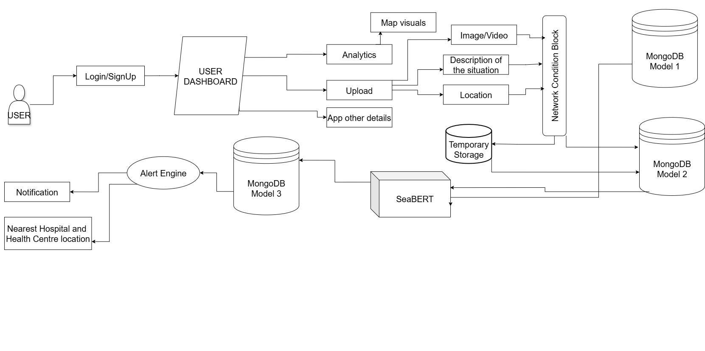
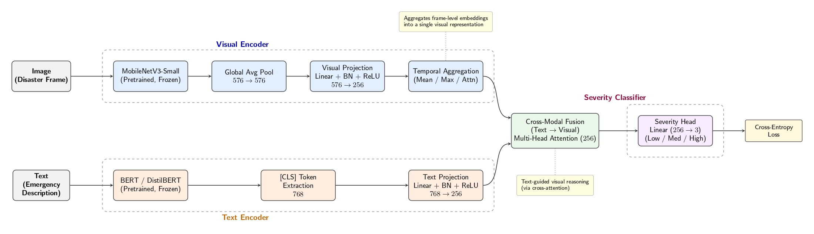

# OceanGuard 🌊

[](https://opensource.org/licenses/MIT)
[](https://www.python.org/downloads/)
[](https://github.com/Arkaneell/oceanguard)

**An Advanced AI-Powered Coastal Risk Intelligence Platform for Disaster Preparedness and Response**

OceanGuard is a cutting-edge multi-modal machine learning system that combines computer vision and natural language processing to provide real-time coastal hazard assessments. By analyzing both visual imagery and textual reports, the platform delivers accurate risk classifications and contradiction detection to enhance disaster management in vulnerable coastal regions.

---

## 🎯 Key Features

### Multi-Modal Risk Assessment
- **Dual-Input Processing**: Simultaneously analyzes coastal images and textual descriptions
- **Computer Vision Analysis**: CNN-based detection of wave patterns, water levels, and flooding indicators
- **NLP-Powered Text Analysis**: Transformer-based models extract urgency signals and disaster indicators
- **Cross-Modal Fusion**: Dedicated learning module combines visual and textual data for unified risk scoring

### Intelligent Contradiction Detection
- Identifies inconsistencies between image evidence and text descriptions
- Reduces misinformation in crowd-sourced emergency reports
- Enhances reliability during critical disaster response situations
- Flags suspicious or conflicting data for human review

### Comprehensive Risk Metrics
- **Wave Severity Index**: Quantifies ocean wave intensity and patterns
- **Flood Probability Score**: Calculates likelihood of coastal flooding
- **Risk Classification**: Four-tier system (Low, Medium, High, Critical)
- **Visual Alert System**: Dashboard warnings for high-risk scenarios

### User-Friendly Interface
- Clean, responsive web design accessible across all devices
- Real-time dashboard with visual risk indicators
- Intuitive upload system for images and text reports
- Professional stakeholder and public user interfaces

---

## 🏗️ System Architecture

### High-Level System Flow



The OceanGuard platform follows a comprehensive workflow from user input to emergency notification:

1. **User Authentication & Dashboard**: Secure login system with personalized dashboard
2. **Multi-Modal Input Processing**: 
   - Image/Video upload for visual analysis
   - Text description of the coastal situation
   - Location data capture
3. **Network Condition Check**: Determines data routing based on connectivity
4. **Data Storage Strategy**:
   - Strong connectivity → Direct to MongoDB (Model 1 & 2)
   - Weak/No connectivity → Temporary storage with later sync
5. **AI Processing Pipeline**: SeaBERT model analyzes combined inputs
6. **Analytics & Visualization**: Real-time dashboard updates with map visuals and charts
7. **Alert System**: Automated notifications for high-risk scenarios
8. **Emergency Response**: Nearest hospital and health center location recommendations

### Deep Learning Model Architecture



#### Visual Encoder Pipeline
- **Feature Extraction**: MobileNetV3-Small (pretrained, frozen backbone)
- **Pooling**: Global Average Pooling (576-dimensional output)
- **Projection**: Linear layer with Batch Normalization and ReLU (576 → 256)
- **Temporal Aggregation**: Mean/Max/Attention mechanisms for video frame sequences

#### Text Encoder Pipeline
- **Language Model**: BERT/DistilBERT (pretrained, frozen)
- **Token Extraction**: [CLS] token embedding (768-dimensional)
- **Projection**: Linear layer with Batch Normalization and ReLU (768 → 256)

#### Cross-Modal Fusion
- **Attention Mechanism**: Multi-head attention for text-guided visual reasoning
- **Feature Dimension**: 256-dimensional unified representation
- **Fusion Strategy**: Cross-attention from text to visual features

#### Severity Classification Head
- **Output Layer**: Linear classifier (256 → 3 classes)
- **Risk Categories**: Low, Medium, High severity levels
- **Loss Function**: Cross-entropy loss for multi-class classification

---

## 🚀 Getting Started

### Prerequisites

```bash
Python 3.8 or higher
pip (Python package manager)
Git
```

### Installation

1. **Clone the repository**
```bash
git clone https://github.com/Arkaneell/oceanguard.git
cd oceanguard
```

2. **Create a virtual environment**
```bash
python -m venv venv
source venv/bin/activate  # On Windows: venv\Scripts\activate
```

3. **Install dependencies**
```bash
pip install -r requirements.txt
```

4. **Set up environment variables**
```bash
cp .env.example .env
# Edit .env with your configuration
```

5. **Run the application**
```bash
python app.py
```

The application will be available at `http://localhost:5000`

---

## 📋 Usage

### Basic Workflow

1. **Upload Coastal Image**: Select and upload a photograph of the coastal area
2. **Provide Text Description**: Enter observational details, weather conditions, or emergency reports
3. **Submit for Analysis**: Click analyze to initiate the multi-modal processing
4. **Review Risk Assessment**: Examine the generated risk scores, classifications, and alerts
5. **Export Report** (optional): Download PDF or JSON format for record-keeping

### Input Guidelines

**Image Requirements:**
- Format: JPG, PNG, or WEBP
- Resolution: Minimum 640x480 pixels recommended
- Content: Clear view of coastline, waves, or flooding conditions
- Avoid: Heavily edited or filtered images

**Text Report Guidelines:**
- Include observable conditions (wave height, water color, weather)
- Mention time and location if known
- Describe any immediate threats or unusual phenomena
- Keep descriptions factual and specific

---

## 🧠 Technical Details

### Computer Vision Module
- **Architecture**:  MobileNetV3-Small
- **Input Processing**: Image preprocessing, normalization, augmentation
- **Feature Detection**: 
  - Wave pattern recognition
  - Water level anomaly detection
  - Coastal infrastructure visibility
  - Weather condition indicators

### Natural Language Processing Module
- **Model**: SeaBERT (Specialized BERT variant using DistilBERT backbone) - *Currently in Development*
- **Capabilities**:
  - Disaster-related entity recognition
  - Urgency classification
  - Sentiment analysis for severity assessment
  - Context-aware keyword extraction

### Cross-Modal Fusion
- **Method**: Attention-based feature fusion
- **Contradiction Detection**: Cosine similarity analysis between modalities
- **Risk Scoring**: Weighted combination of visual and textual confidence scores

### Risk Classification Thresholds
```python
Low Risk:      Score 0.0 - 0.25
Medium Risk:   Score 0.25 - 0.50
High Risk:     Score 0.50 - 0.75
Critical Risk: Score 0.75 - 1.0
```

---

## 🎯 Target Users

### Primary Stakeholders
- **Disaster Management Authorities**: Emergency response planning and coordination
- **Coastal Municipalities**: Infrastructure protection and evacuation planning
- **Marine Industries**: Port operations, shipping safety, offshore activities
- **Meteorological Agencies**: Weather monitoring and forecast verification

### General Public
- Coastal residents concerned about safety
- Beachgoers and recreational users
- Environmental researchers and activists
- Journalists covering coastal events

---

## 🔮 Future Roadmap

### Phase 1: Current Development
- [x] Core multi-modal architecture
- [x] Basic web interface
- [ ] SeaBERT model training and integration
- [ ] Enhanced contradiction detection algorithms

### Phase 2: Real-Time Integration
- [ ] CCTV feed integration
- [ ] Satellite imagery API connection
- [ ] IoT ocean sensor compatibility
- [ ] Automated alert system

### Phase 3: Advanced Features
- [ ] Historical data analysis and trends
- [ ] Predictive modeling for 24-48 hour forecasts
- [ ] Multi-language support
- [ ] Mobile application (iOS/Android)

### Phase 4: Scale & Integration
- [ ] API for third-party integration
- [ ] Regional deployment across coastal zones
- [ ] Government agency partnerships
- [ ] Machine learning model continuous improvement

---

## 🤝 Contributing

We welcome contributions from the community! OceanGuard is an open-source project aimed at improving coastal safety worldwide.

### How to Contribute

1. **Fork the repository**
2. **Create a feature branch** (`git checkout -b feature/AmazingFeature`)
3. **Commit your changes** (`git commit -m 'Add some AmazingFeature'`)
4. **Push to the branch** (`git push origin feature/AmazingFeature`)
5. **Open a Pull Request**

### Development Guidelines
- Follow PEP 8 style guidelines for Python code
- Add unit tests for new features
- Update documentation for API changes
- Ensure all tests pass before submitting PR

### Areas for Contribution
- Model optimization and accuracy improvements
- Frontend UI/UX enhancements
- Data preprocessing pipelines
- Testing and bug fixes
- Documentation and tutorials

---

## 📊 Project Status

**Current Version**: 0.1.0 (Alpha)  
**Development Stage**: Active Development  
**Last Updated**: March 2026

### Known Limitations
- SeaBERT language model is currently under development
- Limited to single-image analysis (batch processing coming soon)
- Real-time data integration not yet implemented
- Model accuracy varies based on image quality and lighting conditions

---

## 📄 License

This project is licensed under the MIT License - see the [LICENSE](LICENSE) file for details.

---

## 🙏 Acknowledgments

- Computer vision components inspired by coastal monitoring research
- NLP techniques adapted from disaster response literature
- Special thanks to the open-source ML community
- Beta testers and early adopters providing valuable feedback

---

## 📧 Contact & Support

**Project Maintainer**: [@Arkaneell](https://github.com/Arkaneell)  
**Repository**: [https://github.com/Arkaneell/oceanguard](https://github.com/Arkaneell/oceanguard)

### Get Help
- **Issues**: Report bugs or request features via [GitHub Issues](https://github.com/Arkaneell/oceanguard/issues)
- **Discussions**: Join conversations in [GitHub Discussions](https://github.com/Arkaneell/oceanguard/discussions)
- **Documentation**: Visit the [Wiki](https://github.com/Arkaneell/oceanguard/wiki) (coming soon)

---

## 🌍 Impact & Vision

OceanGuard represents more than a technical solution—it's a commitment to AI-driven environmental safety and intelligent disaster management. By combining innovation in machine learning with real-world impact, we aim to:

- Reduce casualties and property damage from coastal disasters
- Empower communities with accessible risk information
- Support climate resilience in vulnerable regions
- Advance the field of AI-powered disaster preparedness

Together, we can build safer coastal communities through intelligent technology.

---

## 📸 Screenshots

### System Architecture

*Complete system workflow from user input to emergency alert*

### Model Architecture

*Multi-modal fusion architecture with visual and text encoders*

### Dashboard Preview
*Coming soon - UI screenshots will be added as features are finalized*

---

## 🔧 Technology Stack

- **Backend**: Python, Flask/FastAPI
- **Machine Learning**: PyTorch, TensorFlow
- **Computer Vision**: OpenCV, PIL
- **NLP**: Hugging Face Transformers, BERT variants
- **Frontend**: HTML5, CSS3, JavaScript
- **Database**: PostgreSQL (planned)
- **Deployment**: Docker, Kubernetes (planned)

---

**Built with ❤️ for coastal safety and climate resilience**
